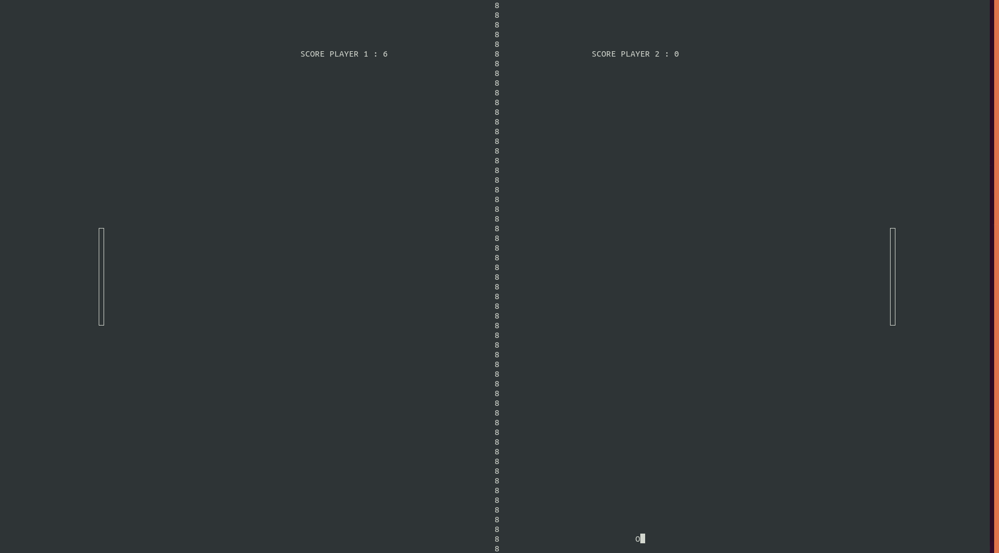

# PONG game with curses librairie in python

It's a simple pong game realize with the python curses librairie 

NB : In order to work, you need your terminal in full screen and tap:

python3 pong_curses.py

# TO DO

Improve the management of to player. For now i struggle to deal with to player especially at a input key level with the curses librairie.

Add a menu to select if you want to play against another humain or an IA.

